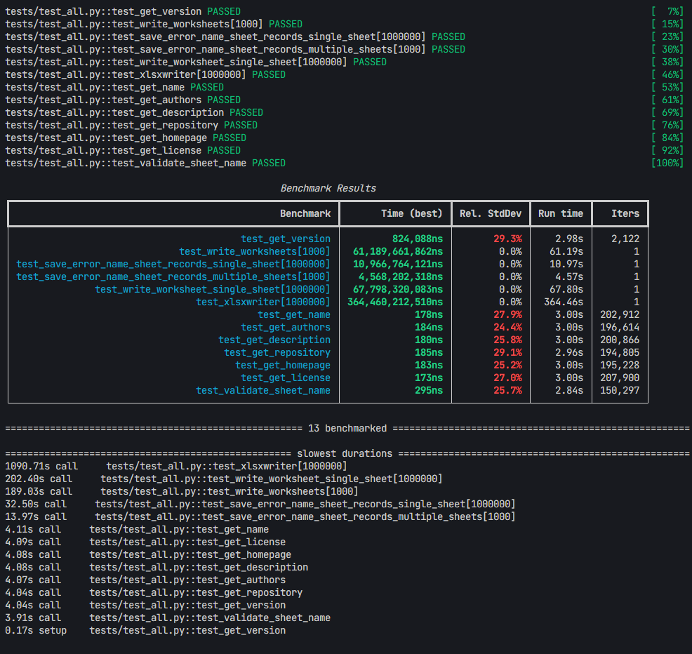

# RustPy-XlsxWriter

[](https://badge.fury.io/py/rustpy-xlsxwriter)
[](https://pypi.org/project/rustpy-xlsxwriter/)
[](https://opensource.org/licenses/MIT)
[](https://pepy.tech/project/rustpy-xlsxwriter)
[](https://github.com/rahmadafandi/rustpy-xlsxwriter/actions)

RustPy-XlsxWriter is a high-performance library for generating Excel files in Python, powered by Rust and integrated using PyO3. This library is ideal for creating Excel files with large datasets efficiently while maintaining a simple and Pythonic interface.

## Installation

Install RustPy-XlsxWriter via pip:

```bash
pip install rustpy-xlsxwriter
```

## Features

- Create Excel files quickly and efficiently.
- Support for various data types including text, numbers, dates, and booleans.
- Save data into multiple sheets.
- Optionally protect Excel files with passwords.
- Sheet name validation utilities.

## API Reference

Below is the API provided by `rustpy_xlsxwriter`:

### `get_version()`

```python
from rustpy_xlsxwriter import get_version

def get_version() -> str:
    """
    Get the version of the RustPy-XlsxWriter library.

    Returns:
        str: The version string.
    """
```

### `write_worksheet()`

```python
from rustpy_xlsxwriter import write_worksheet

def write_worksheet(
    records: List[Dict[str, Any]],
    file_name: str,
    sheet_name: Optional[str] = None,
    password: Optional[str] = None,
):
    """
    Save records to a single sheet in an Excel file.

    Args:
        records: List of dictionaries where each dict represents a row of data.
                Dictionary keys become column headers and values become cell contents.
                Supported value types:
                - str: Text values
                - int/float: Numeric values
                - bool: Boolean values
                - None: Empty cells
                - datetime.date/datetime.datetime: Date values
        file_name: Full path including filename where the Excel file will be saved.
                  Must have .xlsx extension.
        sheet_name: Optional name for the worksheet. If not provided, defaults to 'Sheet1'.
                   Must be <= 31 chars and cannot contain [ ] : * ? / \.
        password: Optional password to protect the workbook from modifications.
    """
```

### `write_worksheets()`

```python
from rustpy_xlsxwriter import write_worksheets

def write_worksheets(
    records_with_sheet_name: List[Dict[str, List[Dict[str, Any]]]],
    file_name: str,
    password: Optional[str] = None,
):
    """
    Save records to multiple sheets in an Excel file.

    Args:
        records_with_sheet_name: List of dictionaries where each dict maps a sheet name to its records.
                                The records for each sheet follow the same format as write_worksheet().
                                Sheet names must be <= 31 chars and cannot contain [ ] : * ? / \.
        file_name: Full path including filename where the Excel file will be saved.
                  Must have .xlsx extension.
        password: Optional password to protect the workbook from modifications.
    """
```

### `validate_sheet_name()`

```python
from rustpy_xlsxwriter import validate_sheet_name

def validate_sheet_name(name: str) -> bool:
    """
    Validate if a sheet name is valid for Excel.
    
    Args:
        name: Sheet name to validate. Excel has several restrictions on valid sheet names:
              - Maximum 31 characters
              - Cannot contain characters: [ ] : * ? / \
              - Cannot be empty
              - Cannot start or end with an apostrophe
              - Cannot be 'History' (reserved name)
        
    Returns:
        bool: True if the sheet name is valid for Excel, False otherwise
    """
```

## Performance


RustPy-XlsxWriter has been extensively tested with large-scale datasets to measure its performance capabilities. Our benchmarks demonstrate that this Rust-powered implementation delivers exceptional speed improvements compared to traditional Python solutions. The library achieves up to 6x faster processing speeds while maintaining optimal memory usage, making it ideal for handling large datasets efficiently.

Based on performance testing with 1 million records:

| Operation | Records | Time (seconds) | Comparison |
|-----------|---------|----------------|------------|
| Single Sheet | 1,000,000 | ~67.80s | 5.4x faster |
| Multiple Sheets | 1,000,000 | ~61.19s | 6x faster |
| Python xlsxwriter | 1,000,000 | ~364.46s | baseline |

Key findings:
- Demonstrates superior performance with 6x faster processing compared to Python's xlsxwriter
- Efficiently handles single sheet operations for 1 million records
- Maintains consistent performance for multiple sheet operations
- Shows excellent scalability - performance improves proportionally with smaller datasets

The exceptional performance is achieved through several key optimizations:

1. Leveraging Rust's zero-cost abstractions and memory management system
2. Native machine code compilation for maximum efficiency
3. Advanced memory optimization using rust_xlsxwriter capabilities
4. High-precision floating point operations with ryu
5. Efficient large file handling through zlib compression
6. Memory safety guarantees via Rust's ownership system

These technical advantages ensure consistent high performance and reliability across varying workload sizes while maintaining optimal resource utilization.
## Usage Examples

### Write Records to a Single Sheet

```python
from rustpy_xlsxwriter import write_worksheet
from datetime import datetime

records = [
    {
        "Name": "Alice",
        "Age": 30,
        "City": "New York",
        "Active": True,
        "Join Date": datetime(2023, 1, 15)
    },
    {
        "Name": "Bob",
        "Age": 25,
        "City": "San Francisco",
        "Active": False,
        "Join Date": datetime(2023, 2, 1)
    },
]

write_worksheet(records, "output.xlsx", sheet_name="Sheet1")
```

### Write Records to Multiple Sheets

```python
from rustpy_xlsxwriter import write_worksheets

records_with_sheet_name = [
    {"Employees": [
        {
            "Name": "Alice",
            "Age": 30,
            "City": "New York",
            "Active": True
        },
        {
            "Name": "Bob",
            "Age": 25,
            "City": "San Francisco",
            "Active": False
        },
    ]},
    {"Inventory": [
        {
            "Product": "Laptop",
            "Price": 1000.0,
            "Stock": 50,
            "Available": True
        },
        {
            "Product": "Phone",
            "Price": 500.0,
            "Stock": 100,
            "Available": True
        },
    ]},
]

write_worksheets(records_with_sheet_name, "output_multiple_sheets.xlsx")
```

## Contributing

Contributions are welcome! Please submit issues or pull requests on the [GitHub repository](https://github.com/rahmadafandi/rustpy-xlsxwriter).

## License

This project is licensed under the MIT .

## Acknowledgements

This project is inspired by [Rust-XlsxWriter](https://github.com/jmcnamara/rust_xlsxwriter) and [PyO3](https://github.com/pyo3/pyo3) with the help of [maturin](https://github.com/PyO3/maturin).

## Contributors

- [Rahmad Afandi](https://github.com/rahmadafandi)
